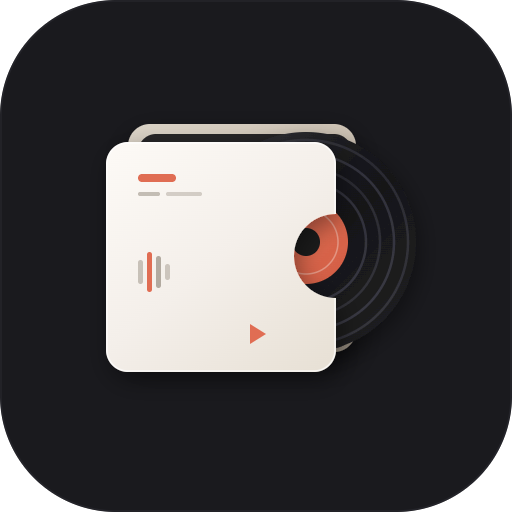
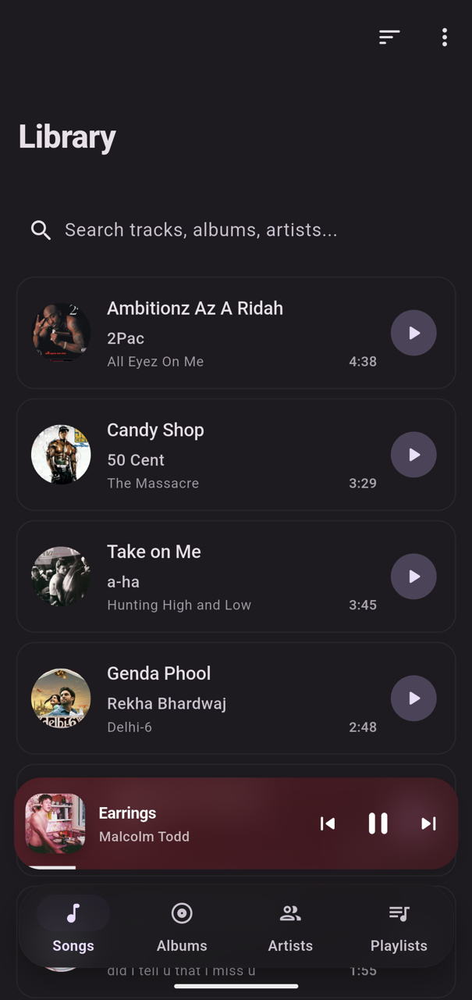
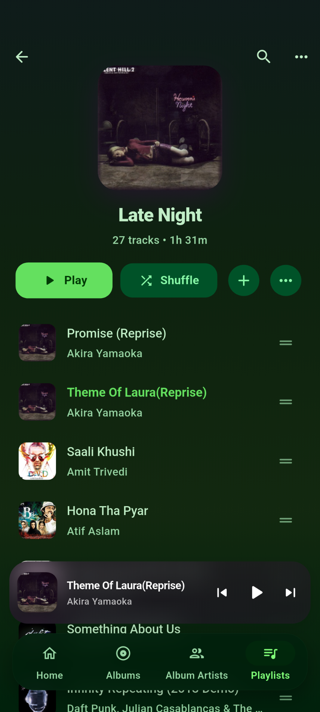
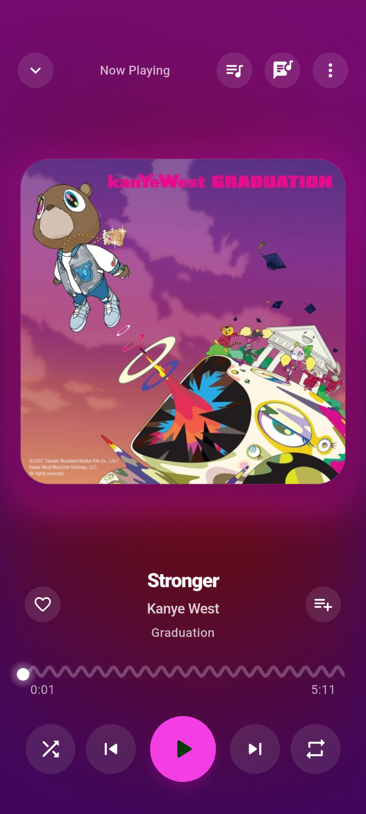
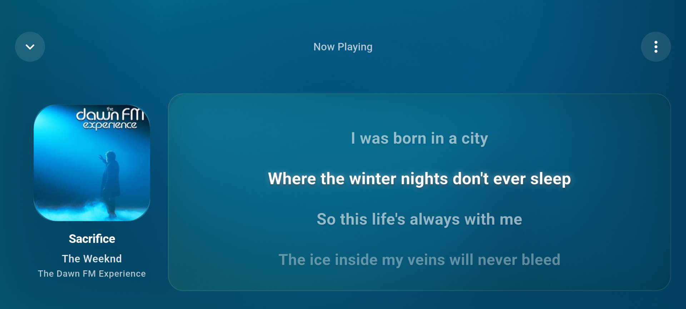

# Sleeve Music Player

<p align="center">
  
</p>

---

## What this project is

**Sleeve Music Player** scans local audio files and turns them into a polished, tactile listening experience focused on:

- quick navigation through large personal music libraries
- stable playback with queue support
- synchronized lyrics and metadata editing
- modern, editorial visuals with dynamic theming and tactile physical aesthetics

It is designed primarily for Android, with support for other Flutter targets where platform capabilities allow.

## Highlights

### Library & discovery
- Browse by **Songs**, **Albums**, and **Artists**
- Built-in global search
- Album/artist-aware sorting modes
- Smart sections such as **Most Played**, **Recently Played**, and **Recently Added**

### Playback experience
- Background playback via `audio_service`
- Lock-screen / notification media controls
- Full queue management and mini player
- Shuffle, repeat, seek, and transport controls

### Personalization
- **Material You / Dynamic Color** integration on supported Android devices
- Artwork-based palette accents
- Theme mode support

### Editing & organization
- Lyrics support for plain text and synchronized **LRC**
- Tag editing for title, artist, album, and cover art
- User playlists with create, rename, delete, and import flow

## Screenshots

### Mobile Experience

<p align="center">
  
  
  
</p>

### Landscape & Synchronized Lyrics

Full-screen listening experience featuring real-time synchronized lyrics and artwork.

<p align="center">
  
</p>

## Tech stack

- **Framework:** Flutter (Dart)
- **Audio:** `just_audio`, `audio_service`, `audio_session`
- **Library query:** `on_audio_query`
- **Storage:** `hive_flutter`, `shared_preferences`
- **Theming & UI:** `dynamic_color`, `palette_generator`, Material 3 design
- **Utilities:** `permission_handler`, `file_picker`, `audiotags`

## Project structure

```text
lib/
├── main.dart                  # App shell, routing, major pages
├── services/                  # Playback and local persistence services
├── data/                      # Models and data-layer helpers
├── pages/                     # Route-level screens (e.g., queue page)
├── dialogs/                   # Lyrics/tag editing dialogs
├── widgets/                   # Reusable playback/search UI components
└── ui/shared/                 # Shared visual components
```

## Getting started

### Prerequisites
- Flutter SDK installed
- Android SDK / emulator (recommended target)

### Run locally

```bash
flutter pub get
flutter run
```

### Basic quality checks

```bash
flutter analyze
flutter test
```

## Platform notes

- **Android:** primary platform and best-supported experience
- **Web:** playback works, but direct file/tag editing is limited by browser file access constraints
- **Linux:** not fully compatibility yet, I'm sure the app compiles and would work to some extent, but I plan to bring full support to Linux in the future.

## Permissions (Android)

- Music library access (`Permission.audio` / storage permission variants)
- Notification permission on Android 13+ for background media controls
- `MANAGE_EXTERNAL_STORAGE` may be required for certain metadata/tag write operations on newer Android versions

## Status

This project is actively being improved with UI refinements, playback reliability enhancements, and richer playlist/metadata workflows.